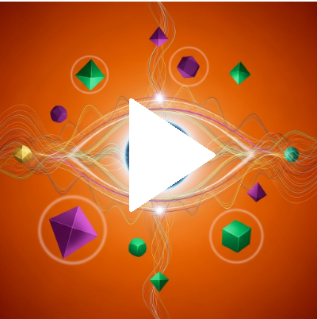
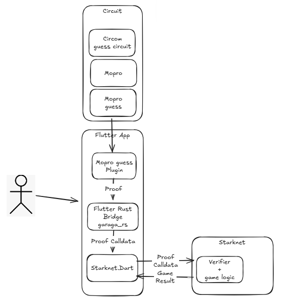

# ZK Extransensory Perception game (ZKPES)

A mobile phone prediction app where you and your friends will have a lot of fun proving your extransensorial powers one against others.

## Getting Started

The purpose of this game is to predict secret number between two players hiding all the secrets thanks to [Circom circuits](https://github.com/rukafe0x/zk_guess/tree/main/circuit/guess.circom), the [Mopro ZK prover](https://github.com/rukafe0x/zk_guess/tree/main/mopro_flutter/lib) in the app, [garaga_rs](https://github.com/rukafe0x/zk_guess/tree/main/rust/src/api.rs) integrated with Flutter Rust Bridge for snark calldata translation and [Starknet.Dart](https://https://github.com/focustree/starknet.dart) to call an on-chain [Starknet verifier contract](https://github.com/rukafe0x/zk_guess/tree/main/contract/zk_guess.cairo) with all token logic to check winner and transfer the tokens.

## How to Play
Notice: This is a full functional app in Sepolia but with a UI as work in progress.

1. Create your free account (Free Starknet Onboarding thanks to AVNU Paymaster and Starknet.dart libraries)
2. Register your game slot in Starknet
3. Set your secret number (full private thanks to hashing and ZK)
4. Invite your friend to install the app and register in the same game slot.
5. In your app, try to guess your friend secret number.
6. Your friend in his app must check if you are ok. (in the background creating the ZK proof and sending it to Starknet verifier contract)
7. Contract will check if number has been guessed and will transfer the reward to the winner

Note: If your friend doesn't send the proof, he will loss automatically after 1000 blocks and you could take the reward.

## TO DO
1. Improve UI
2. Add gassless transactions (to grant free transaction to first users)
3. Communicate apps thru indexers

## ARCHITECTURE

## HOW TO TEST
in cursor, select device emulator-554
cd $HOME/zk_guess
flutter test integration_test/full_gameplay_test.dart -d emulator-5554

## ZK Mopro - Circom
git clone https://github.com/iden3/circom.git
cd circom
cargo build --release
cargo install --path circom
npm install -g snarkjs
git clone https://github.com/iden3/circomlib.git

cd circuit (where is my circuit)
git clone https://github.com/casiojapi/starknet-zk-workshop
circom age_verification.circom --r1cs --wasm --sym --c
snarkjs powersoftau new bn128 12 pot12_0000.ptau -v
snarkjs powersoftau contribute pot12_0000.ptau pot12_0001.ptau --name="First contribution" -v
snarkjs powersoftau prepare phase2 pot12_0001.ptau pot12_final.ptau -v
snarkjs groth16 setup age_verification.r1cs pot12_final.ptau age_verification_0000.zkey
#Prover key
snarkjs zkey contribute age_verification_0000.zkey age_verification_0001.zkey --name="1st Contributor Name" -v
#Verifier key para garaga
snarkjs zkey export verificationkey multiplier2_0001.zkey verification_key.json
copy zkey and wasm to mopro-age/test-vectors/circom/
copy json to garaga

cargo install mopro-cli
mopro init
export ANDROID_HOME="/home/kali/Android/Sdk/"
export NDK_PATH=$ANDROID_HOME/ndk/29.0.14033849
vi src/lib.rs
mopro build
mopro update
descargar MoproAndroidBindings.tar.gz
DESCARGAR MOPROBUILDINGS y HACER UI y VERIFIER
copy jniLibs to mopro_flutter_plugin/android/src/main.
copy uniffi  to mopro_flutter_plugin/android/src/main/kotlin

// Para agregar starknet.dart al proyecto dart
mkdir packages
cd packages
git clone https://github.com/focustree/starknet.dart.git
cd starknet.dart
git submodule update --init --recursive

git fetch
git pull
git checkout main
cargo install --path .

#garaga
cd garaga
source venv/bin/activate
cd
mkdir age-circuit
cd age-circuit/
garaga gen --vk verification_key.json --system groth16
garaga gen --vk ../verification_key.json --system groth16
asdf global scarb 2.11.4
scarb build

## HOW TO DEPLOY CONTRACT
scarb build
sncast --account player1 --accounts-file ../../.starknet_accounts/starknet_open_zeppelin_accounts.json declare-from --sierra-file target/dev/zkguess_integrationtest_Groth16VerifierBN254.test.contract_class.json --url http://localhost:9545/rpc/v0_10 --l1-gas 0 --l1-gas-price 200512996931799 --l2-gas 4200000000 --l2-gas-price 45704468436 --l1-data-gas 288 --l1-data-gas-price 836146516447
sncast --account player1 --accounts-file ../../.starknet_accounts/starknet_open_zeppelin_accounts.json deploy --class-hash 0x1287bd4b5d1bac1548d7c3185d2cf7824749d5a6bb11ac6b5da41625c786d3 --url http://localhost:9545/rpc/v0_10

scarb build
sncast --account player1 --accounts-file ../../.starknet_accounts/starknet_open_zeppelin_accounts.json declare-from --sierra-file target/dev/guess_ZKPes.contract_class.json --url http://localhost:9545/rpc/v0_10
sncast --account player1 --accounts-file ../../.starknet_accounts/starknet_open_zeppelin_accounts.json deploy --class-hash 0x3f03ed868b35d802b03f3069115daa0ec33d31eb82d784a7781449b2d3d5bfc --url http://localhost:9545/rpc/v0_10
