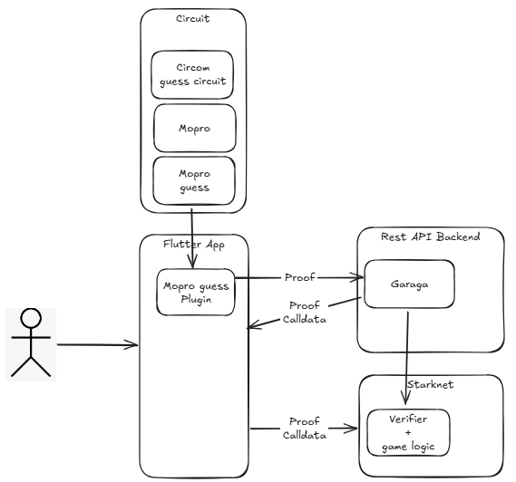

# ZK Extransensory Perception game (ZKPES)

A mobile phone prediction app where you and your friends will have a lot of fun proving your extransensorial powers one against others.

## Getting Started

The purpose of this game is to predict secret number between two players hiding all the secrets thanks to [circom circuits](https://github.com/rukafe0x/zk_guess/tree/main/circuit/guess.circom), the [Mopro ZK prover](https://github.com/rukafe0x/zk_guess/tree/main/mopro_flutter/lib) in the app, a [garaga backend](https://github.com/rukafe0x/zk_guess/tree/main/circuit/garaga_backend.py) for snark calldata translation and a [verifier contract](https://github.com/rukafe0x/zk_guess/tree/main/contract/zk_guess.cairo) deployed in starknet with all token logic to check for the winner and transfer the tokens.

## How to Play
Notice: This is a full functional app in Sepolia but with a UI as work in progress.

1. Create your free account (Free Starknet Onboarding thanks to AVNU Paymaster and Starknet.dart libraries)
2. Register your game slot in Starknet
3. Set your secret number (full private thanks to hashing and ZK)
4. Invite your friend to install the app and register in the same game slot.
5. In your app, try to guess your friend secret number.
6. Your friend in his app must check if you are ok. (in the background creating the ZK proof and sending it to Starknet verifier contract)
7. Contract will check if number has been guessed and will transfer the reward to the winner

Note: If your friend doesn't send the proof, he will loss automatically after 1000 blocks and you could take the reward.

## TO DO
1. Improve UI
2. Add gassless transactions (to grant free transaction to first users)
3. Communicate apps thru indexers

## ARCHITECTURE

