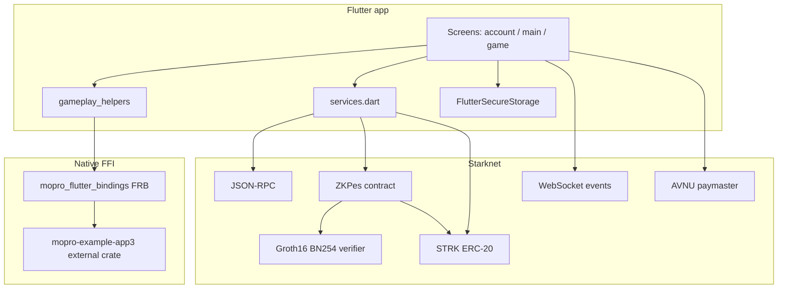

# Architecture

Current architecture of **zk_guess** as implemented in this repository.

## High-level components

## Flutter app (`lib/`)

| Module | Responsibility |
|--------|----------------|
| `main.dart` | `dotenv.load`, `RustLib.init`, app shell; includes legacy `SeedPhraseScreen` |
| `account_selection_screen.dart` | List/create accounts; AVNU sponsored Argent deploy; persist to secure storage |
| `main_screen.dart` | Create game / join by game id navigation |
| `join_game_screen.dart` | Full game UI: commit, approve, create/join, guess, prove+verify, claim; WSS status |
| `services.dart` | Starknet account execute helpers + `getGameProperties` |
| `gameplay_helpers.dart` | Poseidon commitment; copy zkey asset; Circom prove + Garaga calldata |

Selected account is stored under secure storage key `selected_account`. Secrets `x` / `salt` / `hash` keyed by account address.

## Native ZK (`mopro_flutter_bindings`)

- Flutter FFI plugin; Cargokit compiles Rust crate `mopro_flutter_bindings`.
- Depends on **`mopro-example-app3`** at `../../../mopro-example-app3` (not vendored here) with feature `flutter`.
- Public Dart API used by the app: `RustLib` + `generateCircomProof` / `generateCircomGroth16GaragaCalldata` from `third_party/mopro_example_app3.dart` (FRB-generated).
- Assets consumed at prove time: `assets/guess_0001.zkey`, `assets/garaga_verification_key.json` (copied to temp for Rust file paths).

## On-chain (`contract/`)

- Package `guess` (Scarb). Modules: `zk_pes`, `groth16_verifier`, `groth16_verifier_constants`.
- Tool versions: `contract/.tool-versions` (scarb 2.14.0, starknet-foundry 0.57.0).
- `ZKPes` entrypoints: `create_game`, `join_game`, `write_intent`, `verify_intent`, `claim_reward`, `get_game_properties`.
- `verify_intent` calls an external Groth16 BN254 verifier contract (address hardcoded in Cairo).
- Status values (ASCII felts): `created`, `p1_turn`, `p2_turn`, `p1_verify`, `p2_verify`, `win_p1`, `win_p2`, `finished`. Timeout claim path after 1000 blocks is also implemented.
- STRK transfer for rewards uses a hardcoded STRK token address in Cairo (aligned with Sepolia STRK in app env).

## Circuit (`circuit/`)

- `guess.circom`: private `x`, `salt`; public `h`, `y`; output `equal` (Poseidon(x,salt)===h and x===y).
- Template copies `mopro_lib.rs` / `mopro_cargo.toml` document how the circuit is wired into mopro; the live Flutter path uses the external `mopro-example-app3` crate.

## Starknet.dart (`packages/starknet.dart`)

Vendored path dependency (not a pub.dev pin). App uses `starknet`, `starknet_provider`, `avnu_provider`. Other packages in the monorepo exist but are not direct app dependencies.

## External services

| Service | Role |
|---------|------|
| Starknet RPC / WSS | Invokes, reads, game status events |
| AVNU paymaster | Sponsored `deploy` of Argent accounts |
| Deployed ZKPes + verifier | Game logic and proof verification |

No application database: local state is secure storage + on-chain game map.

## Control flow (gameplay)

1. P1: Poseidon commitment → approve STRK → `create_game` → `created`
2. P2: commitment → approve → `join_game` → `p1_turn`
3. Active player: `write_intent(guess)` → `p*_verify` for opponent
4. Opponent: prove (x,salt,h,y) + Garaga calldata → `verify_intent`
5. If wrong: turn passes to verifying player (`p2_turn` after `p2_verify` miss, etc.)
6. If correct: `win_p1` / `win_p2` → winner `claim_reward` → `finished`

Integration test encoding this path: `integration_test/full_gameplay_test.dart`.

## Generated-code boundaries

Do not hand-edit FRB outputs under `mopro_flutter_bindings/lib/src/rust/` or `mopro_flutter_bindings/rust/src/frb_generated.rs`. Regenerate via flutter_rust_bridge / mopro workflow against matching Rust sources, then rebuild the Flutter app so the native library hash matches.
